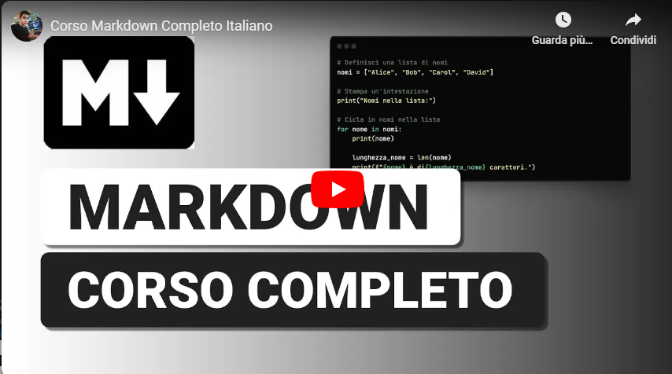

<h1 style='color: purple;'>
    Markdown
</h1>

Il trick del video incorporato:
[](https://www.youtube.com/watch?v=jz0WfxLXth8)

### Gli elementi più comuni
`CTRL + K` e poi `V`  
Backtick \` con `ALT + 96`

https://www.markdownguide.org/cheat-sheet/

Possiamo usare **Git** per collaborare insieme nella scrittura e modifica di un file md.


con tre \`\`\` possiamo incorporare codice:

```js
let testo = "ciao"
console.log(testo)
```

```py
testo = "ciao"
print(testo)
```

```shell
git commit -m "ricordati di mettere il messaggio di commit"
```

> Attento devi ricordarti di mettere il messaggio di commit ogni volta!  
> E se poi te ne penti?
---
---
---

Lista della spesa
1. pesce
1. carne
1. nè carne nè pesce

- pesce
- carne
- nè carne nè pesce

### Tabella

| Syntax | Description |
| ----------- | ----------- |
| Header | Title |
| Paragraph | Text |

 

### Heading ID {#heading-id}  
Gli heading possono avere un heading id 

https://www.markdownguide.org/extended-syntax/#heading-ids

[Questo è il link](#heading-id)  